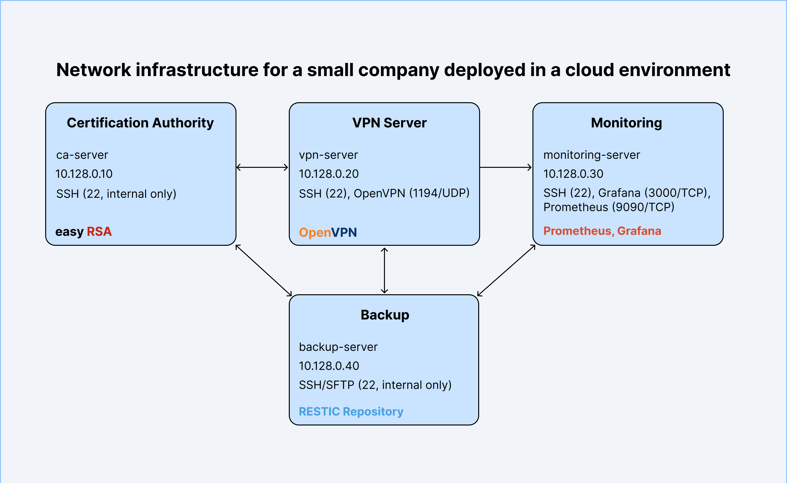

# Infrastructure for Small Business

This repository contains infrastructure configuration and tools for a small business environment deployed in the cloud (e.g., GCP, Yandex Cloud, etc.).  
It includes PKI management, VPN access, centralized monitoring, and automated backups.

## Infrastructure Overview

| Purpose                                   | Hostname           | Internal IP  | External IP      | Ports                              | Services                  |
|-------------------------------------------|--------------------|--------------|------------------|-------------------------------------|---------------------------|
| Certificate Authority (CA)                | ca-server          | 10.128.0.10  | —                | 22 (internal only)                  | Easy-RSA PKI               |
| VPN server                                | vpn-server         | 10.128.0.20  | —                | 22, 1194/UDP                        | OpenVPN                    |
| Monitoring (Prometheus + Grafana)         | monitoring-server  | 10.128.0.30  | 34.xxx.xxx.xxx   | 22, 3000/TCP, 9090/TCP               | Prometheus, Grafana        |
| Backup server                             | backup-server      | 10.128.0.40  | —                | 22 (internal only)                  | Restic SFTP repository     |

---

## Network Diagram



---

## Components

- **restic-backup** – Automated backup scripts for all servers
- **vpn-tools** – VPN management scripts
- **ca-tools** – Easy-RSA Certificate Authority management scripts
- **monitoring-rules** – Prometheus alert rules

## Installation

Download `.deb` packages from [Releases](https://github.com/allbury2007/infra-packs/releases) and install:

```bash
sudo dpkg -i package_name.deb
```


## License
MIT License — see [LICENSE](./LICENSE) for details.
